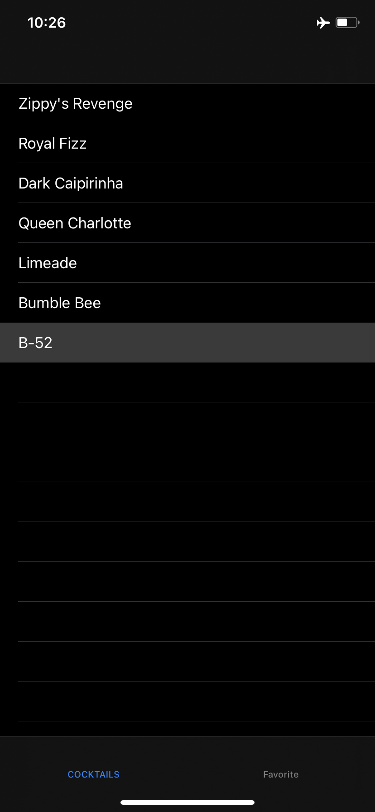
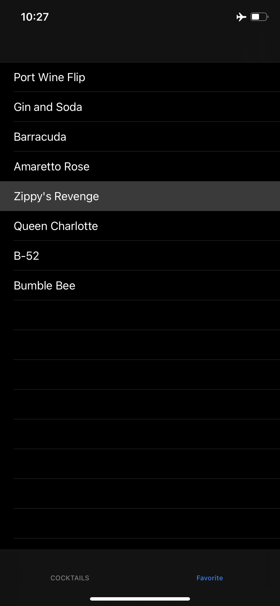
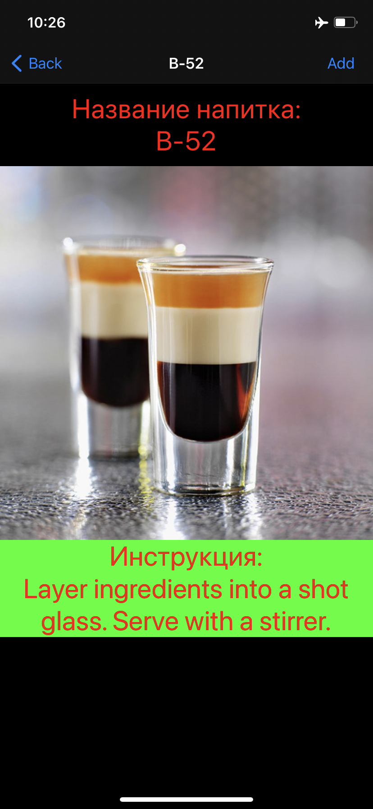

# CocktailApp

1 экран
При запуске приложения генерируется рандомно 10 позиций.

2 экран
Сохраненные позиции

3 экран
Детальная информация с возможностью сохранить позицию

Что использовано:

 - MVVM
 - Coordinator 
 - Networking
 - Realm
 - Весь UI в коде
 
 
